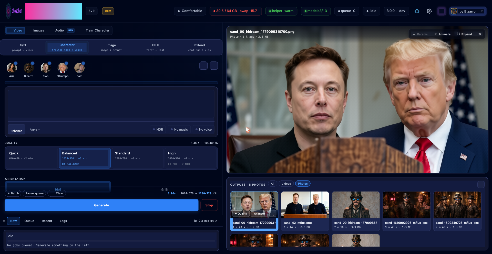
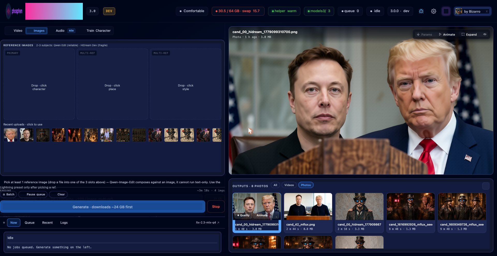
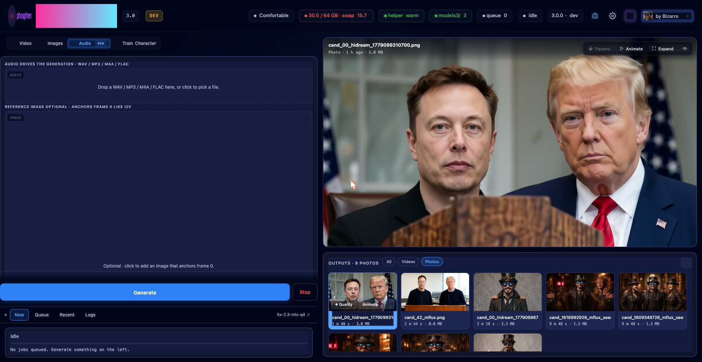
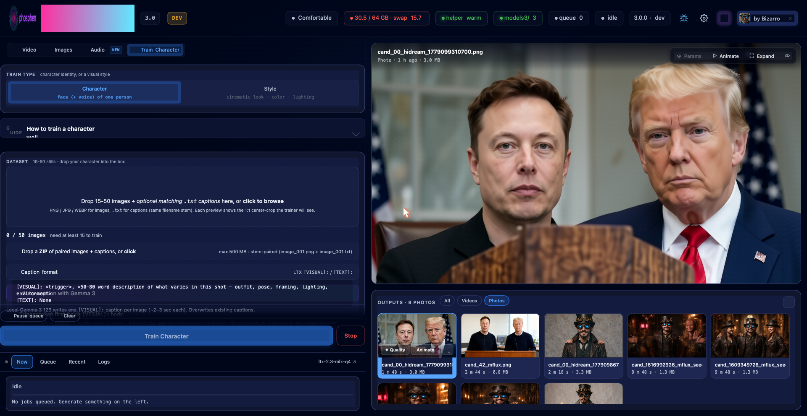

<p align="center">
  
</p>

<p align="center">
  <strong>Generative video, image, and character training on your Mac.</strong><br>
  MLX. No PyTorch, no CUDA, no cloud, no API key.<br>
  <a href="https://x.com/PhospheneAI">@PhospheneAI</a> on X · <a href="https://github.com/mrbizarro/phosphene">github.com/mrbizarro/phosphene</a>
</p>

<p align="center">


</p>

## Overview

Phosphene is a local generative-media panel for Apple Silicon. It runs [LTX-Video 2.3](https://github.com/Lightricks/LTX-Video) (MLX port) for joint audio-and-video synthesis, [Qwen-Image-Edit-2511](https://huggingface.co/Qwen/Qwen-Image-Edit-2511) and an MLX port of [HiDream-O1-Image-Dev](https://huggingface.co/HiDream-ai/HiDream-O1-Image-Dev) for stills, and ships an in-panel LoRA training pipeline for character identity (face + optional voice from a single dataset). Everything runs on-device. No cloud, no API keys, no telemetry.

3.0 introduces in-panel character training (face + voice LoRA from one dataset), the Audio-to-Video workflow, the Image Studio tab with two MLX-native engines, hardware capability tiering, and an agentic prompt enhancer / shot planner driven by the same local Gemma 3 12B used for auto-captioning.

A 7-second character clip with synced audio renders in roughly 6 minutes on an M4 Max 64 GB. The delivered file is **1280×720 HD** after the built-in 2× upscale; clips are generated at 1024×576 internally and upscaled before mux. Voice + face LoRAs from a 50-image dataset finish in ~3 hours on the same hardware.

The interface adapts to the machine it runs on. Under 48 GB of unified memory, the panel exposes only what fits in that envelope (text-to-video, image-to-video, and the Image tab). At 48 GB and above, character mode, first/last-frame keyframing, clip extension, and the Q8 HQ pipelines become available. Tier detection runs once at boot and the unsupported surfaces are hidden rather than greyed out.

## Features

### Video


Text-to-video, image-to-video, and audio-to-video, all delivered as MP4 with joint audio (lip-sync, footsteps, ambience) in a single diffusion pass. Output is 1280×720 after the built-in 2× upscale. Character mode renders against the Q8 dev transformer with a fused character LoRA; the server-side validator refuses Q4 + character to prevent silent identity drift. First/last-frame keyframing and clip extension are available on the Q8 surface, with TeaCache wired through both.

### Image Studio


Two MLX-native engines share the same tab and the same GPU memory pool. Qwen-Image-Edit-2511 handles instruction edits ("change the white jacket to red") and multi-subject composition with up to three reference images. HiDream-O1-Image-Dev handles photoreal at HD — the MLX port of HiDream-O1 ships with Phosphene (8B Qwen3-VL backbone, unified pixel-patch transformer, MIT-licensed; weights at `mlx-community/HiDream-O1-Image-Dev-mlx-bf16`). It lives in a sibling clone, loaded on demand. Both engines drop cards into a unified gallery, each with an Animate button that pre-fills the I2V form with the source still.

### Train Character


End-to-end LoRA training inside the panel. The dataset uploader accepts 15 to 500 images per character. Captions are written by a local Gemma 3 12B (MLX, 4-bit) in roughly 90 seconds for a 37-image dataset, in the `[VISUAL]: <trigger>, <description>` format the LTX trainer expects. The default recipe is rank 32, alpha 32, 100 epochs, lr 1e-4, 512 px resolution, letterbox crop; total step count auto-scales with the dataset (e.g. 50 images → 5000 steps, 100 images → 10000 steps) so adding photos doesn't shift the trained-epochs target. Power users can override any of those in an advanced section. Optional voice LoRA from the same training run.


The Train tab also exposes **Style** training (experimental in v3.0) — same end-to-end pipeline, different intent: a curated set of movie frames teaches the model an aesthetic (color grading, lighting, composition) rather than an identity. The trained style LoRA stacks with character LoRAs at render time. Lightly validated as of v3.0; please report rough edges via [GitHub Issues](https://github.com/mrbizarro/phosphene/issues).

### Audio-to-Video

New workflow tab in 3.0. WAV or MP3 in, MP4 out — the audio drives motion in the generated video, and an optional reference image anchors frame zero. The pipeline runs in two stages: low-resolution with classifier-free guidance, then full-resolution with the distilled LoRA fused on top. The original input audio is muxed onto the final clip so the result is a single self-contained MP4. Requires Q8 + ≥64 GB unified memory.

### LoRAs

Drop `.safetensors` into `mlx_models/loras/` for immediate use, or browse and install LTX 2.3 LoRAs from CivitAI inside the panel (per-row rename, download, companion-aware delete). Character bundles live alongside style LoRAs and are filtered out of the regular picker so they don't show up twice.

## Hardware

Apple Silicon only. MLX is Apple-only by design.

| RAM | Tier | What runs |
|---|---|---|
| Under 48 GB | Compact (Q4 surface) | Text and image-to-video at smaller sizes. Image tab works. Character, FFLF, Extend, and HQ are hidden. They need Q8. |
| 48 to 79 GB | Comfortable (Q8 surface) | The canonical tier, built on M4 Max 64 GB. Everything works. FFLF and Extend capped at 768 px long side. |
| 80 to 119 GB | Roomy | Most modes at full size. FFLF and Extend up to 1024 px. |
| 120 GB+ | Studio | No size limits. |

Working-memory footprint is non-negotiable: standard 1280×704 generation peaks at roughly 22 GiB resident, and HQ with the Q8 dev transformer at roughly 38 GiB. Tier is detected once at boot from RAM and exposed to the UI via `body[data-cap-tier="q4|q8"]`. Set `LTX_FORCE_CAP_TIER=q4` to preview the Compact surface from a higher-tier machine.

## Install

### Via Pinokio (recommended)

1. Install [Pinokio](https://pinokio.computer).
2. In Pinokio: **Discover** -> **Download from URL** -> paste `https://github.com/mrbizarro/phosphene`.
3. Click **Install**.
4. Click **Start** -> **Open Panel** -> http://127.0.0.1:8198.

Pinokio handles the hardware gate, the upstream `dgrauet/ltx-2-mlx` clone, the uv-managed Python 3.11 venv, the runtime patches, and the filtered model download (~28 GB: Q4 plus the Gemma encoder).

For the Q8 HQ tier (required for Character, FFLF, Extend), click **Download Q8** in the panel sidebar after first launch. About 37 GB, one time.

If you have a Hugging Face token, paste it under **Settings** in the panel. Downloads run roughly 10x faster, and the same token unlocks the gated LoRAs (HDR and Lightricks Control).

### Manual install

```bash
# 1. Clone Phosphene + the upstream MLX port (pinned to v0.14.0).
git clone https://github.com/mrbizarro/phosphene.git
cd phosphene
git clone https://github.com/dgrauet/ltx-2-mlx.git ltx-2-mlx
cd ltx-2-mlx && git checkout v0.14.0 && cd ..

# 2. Create the Python 3.11 venv inside ltx-2-mlx (uv-managed).
cd ltx-2-mlx
uv venv --python 3.11 --seed env

# 3. Install the MLX pipeline + trainer packages. Pin mlx to 0.31.1 —
#    0.31.2 attenuates the LTX vocoder by 22 dB.
./env/bin/uv pip install --python env/bin/python \
  'mlx==0.31.1' 'mlx-lm==0.31.1' 'mlx-metal==0.31.1'
./env/bin/uv pip install --python env/bin/python \
  ./packages/ltx-core-mlx ./packages/ltx-pipelines-mlx ./packages/ltx-trainer
./env/bin/uv pip install --python env/bin/python \
  pyyaml pydantic tqdm rich
# mlx-vlm powers Gemma 3 auto-caption. --no-deps so it doesn't drag mlx-lm past 0.31.1.
./env/bin/uv pip install --python env/bin/python --no-deps 'mlx-vlm==0.4.4'
# Agent + downloader + hub pin range.
./env/bin/pip install pillow numpy 'huggingface-hub>=1.5.0,<2.0' \
  'hf_transfer>=0.1.6' 'litellm>=1.83.14' 'smolagents>=1.24.0'
cd ..

# 4. Apply the runtime patches (idempotent, fail loud on upstream drift).
./ltx-2-mlx/env/bin/python3.11 patch_ltx_codec.py

# 5. Download the Q4 LTX weights + the Gemma 3 4-bit encoder (~28 GB total).
HF_HUB_ENABLE_HF_TRANSFER=1 ./ltx-2-mlx/env/bin/hf download \
  dgrauet/ltx-2.3-mlx-q4 --local-dir mlx_models/ltx-2.3-mlx-q4
HF_HUB_ENABLE_HF_TRANSFER=1 ./ltx-2-mlx/env/bin/hf download \
  mlx-community/gemma-3-12b-it-4bit --local-dir mlx_models/gemma-3-12b-it-4bit

# 6. (Optional) Image tab — install mflux + apply the FBCache patch.
./ltx-2-mlx/env/bin/pip install 'mflux==0.17.5'
./ltx-2-mlx/env/bin/pip install --force-reinstall --no-deps 'mflux==0.17.5'
./ltx-2-mlx/env/bin/python3.11 patch_mflux_fbcache.py

# 7. (Optional) HiDream — separate one-time clone for the photoreal engine.
#    Clone HIDREAM-O1-MLX-LAB-active into your home directory, or set
#    HIDREAM_LAB_DIR to point at it.
#    git clone <hidream-lab-repo> ~/HIDREAM-O1-MLX-LAB-active

# 8. Launch the panel.
./ltx-2-mlx/env/bin/python3.11 mlx_ltx_panel.py
```

About the version pins: `mlx 0.31.2` attenuates the LTX vocoder by 22 dB. Stay on 0.31.1. `ltx-2-mlx` is pinned to `v0.14.0` — upstream is about to ship breaking changes. `mflux 0.17.5` is the version `patch_mflux_fbcache.py` is line-targeted against.

## Interface

Four workflow tabs at the top of the panel: Video, Images, Audio, Train Character. Each is a single page; the helper subprocess and model state persist across tab switches.

<table>
<tr>
<td width="50%"></td>
<td width="50%"></td>
</tr>
<tr>
<td align="center"><sub><b>Video / Character mode</b> · round-avatar picker, voice indicator, manage modal</sub></td>
<td align="center"><sub><b>Images</b> · Qwen Edit, HiDream-O1, multi-ref composition</sub></td>
</tr>
<tr>
<td width="50%"></td>
<td width="50%"></td>
</tr>
<tr>
<td align="center"><sub><b>Audio</b> · voice or music clip drives generation; optional reference image anchors frame 0</sub></td>
<td align="center"><sub><b>Train Character</b> · drop 15-50 photos, Gemma 3 auto-captions, optional voice LoRA</sub></td>
</tr>
</table>

Prompting notes:

- Video / text mode: describe sound the same way you describe scene; the audio path reads the same prompt as the visual.
- Video / image mode: prompt with motion beats rather than describing the still. Roughly one beat per 2–3 seconds of clip length.
- Video / character mode: select an avatar from the picker, include the trigger word in the prompt. Q8 Draft (736×416) for iteration, Q8 Pro (1024×576 → 1280×720 final) for delivery.
- Images: zero to three reference slots. Empty zone is text-to-image. Qwen-Image-Edit instructions are read literally — "change the white jacket to red" preserves the rest of the scene.
- Train Character: center crop for tight portraits, letterbox for wide-shot proportions. The default preset (rank 32, alpha 32, 100 epochs, lr 1e-4) is validated end-to-end and recommended as the starting point.

## Migrating from 2.0

Quit Pinokio (or the panel terminal), then click Update, then Start. Renders, settings, queue, models, and LoRAs all persist across the upgrade via Pinokio's `fs.link` persistent drive. The first update takes a few minutes.

> **Click Update twice on the first v2 → v3 upgrade.** Pinokio loads the user's existing on-disk `update.js` before pulling the new one, which means the v2.x script runs first and doesn't install the new dependencies (ltx-trainer package, mlx-vlm, the trainer's transitive deps). The second Update click runs the new 3.0 script and installs everything. This only applies to the very first migration from a v2.x install.

Behavioral changes worth noting in 3.0:

- Character is a first-class mode pill on the Video tab, no longer a chip nested inside T2V.
- Q8 HQ is the default quality for character renders. The server-side validator rejects Q4 + character combinations to prevent identity-degraded output.
- TeaCache is wired through both Extend and Audio-to-Video stage 1.
- Vertical-player chrome is positioned outside the right edge so 9:16 clips are no longer occluded by controls.
- Training presets now scale step count by `epochs × image_count`. The 100-epoch "high" preset that produced the validated v2 LoRAs preserves its shape regardless of dataset size.

## What's in the repo

- `mlx_ltx_panel.py` is the panel HTTP server. One file, around 22k lines, with HTML, CSS, and JS inlined as the page string. Worker thread plus helper subprocess management plus capability tier detection.
- `mlx_warm_helper.py` is the long-running inference subprocess. Holds T2V, I2V, Extend, HQ, and Keyframe pipelines. Reads job specs from stdin, emits events to stdout.
- `image_engine.py` dispatches the Image tab. Backends `hidream`, `mflux`, `mock`. Each spawns its own subprocess with `start_new_session=True` so `/stop` kills the whole tree.
- `patch_ltx_codec.py` applies idempotent runtime patches: lossless H.264, free-DiT-before-decode, VAE temporal streaming for long clips.
- `lora_lab/` is vendored from the [`lora-lab`](https://github.com/mrbizarro/lora-lab) authoring tree. Training works out of the box; set `LTX_LORA_LAB_ROOT` to iterate against an external clone.
- `mlx_models/` and `mlx_outputs/` both persist across Pinokio Reset via fs.link.

An MLX port of [HiDream-O1-Image-Dev BF16](https://huggingface.co/mlx-community/HiDream-O1-Image-Dev-mlx-bf16) (8B Qwen3-VL backbone, unified pixel-patch transformer, MIT) is included for the Image tab. HiDream lives in a sibling clone (see Setup).

## License and credits

Panel: MIT, see [LICENSE](LICENSE). LTX-Video 2.3 weights: Lightricks' license. MLX: Apache 2.0. Gemma 3 12B: Google's terms. PiperSR: AGPL-3.0.

Phosphene depends on the following projects:

- [Lightricks](https://github.com/Lightricks/LTX-Video) — LTX 2.3 and the joint audio + video architecture
- [@dgrauet](https://github.com/dgrauet/ltx-2-mlx) — MLX port of LTX-Video; the foundation everything else builds on
- [Apple ML team](https://github.com/ml-explore/mlx) — MLX
- [HiDream-ai](https://huggingface.co/HiDream-ai/HiDream-O1-Image-Dev) — HiDream-O1 weights and reference implementation
- [filipstrand/mflux](https://github.com/filipstrand/mflux) — MLX-native FLUX and Qwen-Edit family
- [mlx-community](https://huggingface.co/mlx-community) — Gemma 3 12B 4-bit
- [ModelPiper / PiperSR](https://github.com/ModelPiper/PiperSR) — optional 2× upscale on the Apple Neural Engine
- [@cocktailpeanut](https://twitter.com/cocktailpeanut) — Pinokio

What Phosphene adds on top of those: a persistent batch queue, a warm helper subprocess with capability-tier feature gating, lossless H.264 output with JSON sidecars, the in-panel character + voice LoRA training pipeline, the Image tab dispatch layer with adaptive wall-time estimates, the agentic prompt-enhancer / shot planner, and the Pinokio install + update lifecycle scripts.

## Roadmap

Upcoming work — three-aspect character LoRAs, scene/room LoRAs for
location continuity across clips, a real multi-character workflow,
and stacking-aware strength balance — is tracked in [ROADMAP.md](ROADMAP.md).
Contributors and feature requests welcome via GitHub Issues.

## Support development

Phosphene is free and open source.

- Follow [@PhospheneAI](https://x.com/PhospheneAI) on X for releases and clips
- Patreon: https://www.patreon.com/PhospheneAI
- Issues and PRs: https://github.com/mrbizarro/phosphene

## Network note

Phosphene runs locally. No telemetry. A clean production install checks GitHub every 30 minutes for an update badge, and only touches Hugging Face or CivitAI when you download models or LoRAs. Disable the update check with `PHOSPHENE_DISABLE_VERSION_CHECK=1`. The panel binds to `127.0.0.1` with no auth. It's not designed for LAN exposure or tunneling.
