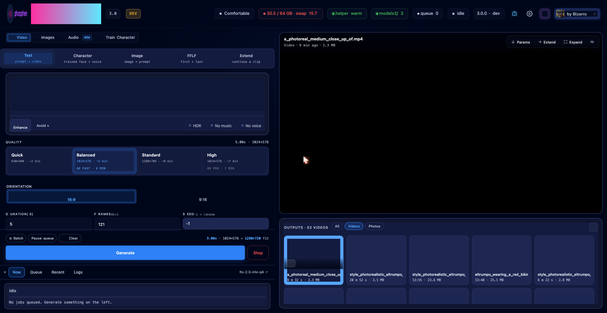

<p align="center">
  
</p>

<p align="center">
  <strong>Local generative video, image, and character training for Apple Silicon.</strong><br>
  Native MLX. One-click install via <a href="https://pinokio.computer">Pinokio</a>. No cloud, no API key.<br>
  <a href="https://x.com/PhospheneAI">@PhospheneAI</a> on X · <a href="https://github.com/mrbizarro/phosphene">github.com/mrbizarro/phosphene</a>
</p>

<p align="center">
  
</p>

---

## Phosphene 3.0

3.0 is a new panel. Same single-window feel, but the surface is rebuilt
around three workflows and a hardware-aware capability tier — so a 32 GB
Mac sees a clean Q4 panel, and a 64 GB+ Mac sees the full thing.

**Headline ships**

- **Image Studio** is its own workflow. HiDream-O1-Image-Dev, Qwen-Image-Edit-2511, and the FLUX / Klein family. All native MLX. Multi-reference subject composition. Adaptive wall-time estimates that learn per-engine on your rig.
- **Train Character** is in the panel. Drop 30–80 photos, click Train, walk away. Local Gemma 3 12B auto-captioner. Optional voice LoRA from a short clip. Letterbox-crop strategy preserves wide-shot proportions. ~3 hours for a face LoRA on M4 Max 64 GB.
- **Character mode** is promoted from a buried chip to a first-class mode pill. Compact avatar picker at the top of the form, click to switch, voice / silent indicators, Manage Characters modal for rename + delete.
- **Q8 HQ is the default character-quality path.** A 7-second character clip at 1024×576 lands in ~6 minutes on M4 Max — down from ~12+ min in 2.0 — thanks to the capability-tier refactor + Codex's skip-step optimization. Server-side guardrails refuse character + Q4 so identity can't silently degrade.
- **Capability tier system.** `body[data-cap-tier="q4|q8"]` is set at boot from detected RAM. Q4 panel hides Q8-only intents (HQ, FFLF, Extend, Character). Q8 panel shows the full surface. One repo, two clean surfaces.
- **TeaCache in Extend** (today). Plus the mflux image-gen path fix, mflux binary path resolver fix, and the Q8-HQ boot-cascade fix that kept the Fast pill from firing on first render.

**Major behind-the-scenes**

- Workflow tabs renamed and reordered: **Video / Images / Train Character**. Phone-icon orientation picker. Multi-subject prompt coaching when 2+ references are loaded. Vertical-player chrome moved outside the right edge so it stops covering 9:16 clips. Voice opt-out toggle for character generation. Improved Load Params (restores Character mode + actual seed used, not the -1 sentinel).
- Boot-time HQ skip-step bug fixed. HF cache fallback hardened. Train preflight finds the dev transformer in either q4 or q8 dirs. Server-side validation for character + quality combinations.

If you came from 2.0: **Stop · Update · Start** in Pinokio. Your renders, settings, queue, models, and LoRAs all survive (Pinokio's `fs.link` persistent drive). Update can take a few minutes the first time.

---

## What Phosphene does

- **Video** — text → video, image → video, first/last-frame keyframing, extend an existing clip. Every clip ships with synced audio in one diffusion pass (lip-sync, footsteps, ambient bed).
- **Character** — generate with a trained face LoRA. Optional voice LoRA stacks automatically. Q8 HQ path, ~6 min for a 7 s 1024×576 clip on M4 Max.
- **Image Studio** — HiDream-O1-Image-Dev (BF16), Qwen-Image-Edit-2511 (Q6/Q8 via mflux), FLUX.1 family. Single-shot or multi-reference subject composition. Edit by instruction ("change the white jacket to red") preserves scene + identity.
- **Train Character** — in-panel LoRA training pipeline. Face LoRA + optional voice LoRA from one dataset. Gemma 3 12B auto-captions on-device.
- **LoRAs and CivitAI** — drop `.safetensors` in `mlx_models/loras/`, or browse and install CivitAI LTX 2.3 LoRAs from the panel. Per-row rename, download, and companion-aware delete.

Hardware tier auto-detected at boot. The panel shows you what's available; what isn't is hidden, not greyed out.

---

## Hardware

Apple Silicon only. MLX is Apple-only by design — no Intel, no Linux, no Windows.

| RAM | Tier | What runs |
|---|---|---|
| **Under 48 GB** | Compact (Q4 surface) | Text / Image video at smaller sizes (≤ 768 px long side). Image Studio works. Character / FFLF / Extend / HQ hidden — they need Q8. |
| **48–79 GB** | Comfortable (Q8 surface) | The canonical tier — built on M4 Max 64 GB. Every mode works. FFLF / Extend capped at 768 px. |
| **80–119 GB** | Roomy | Most modes at full size. FFLF / Extend up to 1024 px. |
| **120 GB+** | Studio | No size limits. |

LTX 2.3's working memory is real — there's no shortcut. Standard 1280×704 generation peaks ~22 GiB resident; HQ with the Q8 dev transformer is closer to 38 GiB. The tier system enforces this honestly instead of letting jobs fall out of the OOM killer.

Use `LTX_FORCE_CAP_TIER=q4` to view the Q4 surface from a Q8 machine (useful for testing or just to see what the entry-level panel looks like).

---

## Install

### Via Pinokio (recommended)

1. Install [Pinokio](https://pinokio.computer).
2. In Pinokio: **Discover → Download from URL** → paste `https://github.com/mrbizarro/phosphene`.
3. Click **Install**.
4. Click **Start** → **Open Panel** → http://127.0.0.1:8198.

Pinokio handles the rest: Apple Silicon hardware gate, the upstream `dgrauet/ltx-2-mlx` clone, the uv-managed Python 3.11 venv, the codec + memory patches, and the filtered model download (~28 GB: Q4 + Gemma encoder).

<!-- Pinokio install screenshot can land here once we record one. -->

For the Q8 HQ tier (required for Character, FFLF, Extend), click **Download Q8** in the panel sidebar after first launch (~37 GB, one-time).

For ~10× faster downloads, open **⚙ Settings** in the panel and paste a Hugging Face token. The same token unlocks gated LoRAs (HDR + Lightricks Control LoRAs).

### Manual install

```bash
git clone https://github.com/mrbizarro/phosphene.git
cd phosphene
git clone https://github.com/dgrauet/ltx-2-mlx.git ltx-2-mlx
cd ltx-2-mlx
uv venv --python 3.11 --seed env
./env/bin/pip install ./packages/ltx-core-mlx ./packages/ltx-pipelines-mlx
./env/bin/pip install pillow numpy 'huggingface-hub>=1.0' \
  'mlx==0.31.1' 'mlx-lm==0.31.1' 'mlx-metal==0.31.1'
cd ..
./ltx-2-mlx/env/bin/python3.11 patch_ltx_codec.py
./ltx-2-mlx/env/bin/python3.11 mlx_ltx_panel.py
```

> **Why the version pins?** `mlx 0.31.2` attenuates the LTX vocoder by ~22 dB. Stay on 0.31.1.

---

## Quick start

Pick a workflow at the top: **Video**, **Images**, **Audio**, or **Train Character**. Each one is a single page.

<table>
<tr>
<td width="50%"></td>
<td width="50%"></td>
</tr>
<tr>
<td align="center"><sub><b>Video / Character mode</b> — round-avatar picker, voice indicator, manage modal</sub></td>
<td align="center"><sub><b>Images</b> — Qwen Edit / HiDream-O1 / FLUX, multi-ref subject composition</sub></td>
</tr>
<tr>
<td width="50%"></td>
<td width="50%"></td>
</tr>
<tr>
<td align="center"><sub><b>Audio</b> — voice or music clip drives generation; optional reference image anchors frame 0</sub></td>
<td align="center"><sub><b>Train Character</b> — drop 30–80 photos, Gemma 3 auto-captions, optional voice LoRA</sub></td>
</tr>
</table>


**Text → video**
1. Video tab → **Text** mode pill.
2. Type a prompt. Describe the soundscape the same way you describe the scene.
3. Pick a Quality pill (Quick / Balanced / Standard / High).
4. Generate.

**Image → video**
1. Video tab → **Image** mode pill.
2. Drop a reference image. The panel covers and crops to model dims for you.
3. Prompt with explicit motion beats (not the still-image description). ~1 beat per 2–3 seconds of clip.
4. Generate.

**Character (trained face + voice)**
1. Video tab → **Character** mode pill.
2. Pick an avatar from the chip strip at the top of the form.
3. Type a prompt that includes your character's trigger word.
4. Q8 Draft (736×416) for fast iteration, Q8 Pro (1024×576) for final.
5. Generate. ~6 min for a 7 s clip on M4 Max.

**Image Studio**
1. **Images** tab.
2. Pick an engine. HiDream-O1 (Fast / Medium / Quality) for photoreal at HD. Qwen-Image-Edit-2511 for instruction edits and subject composition.
3. Drop 1–3 reference images for edit / multi-ref work, or leave empty for text-only.
4. Generate. Cards land in the unified Outputs gallery — click **Animate** on a card to pre-fill the I2V form.

**Train Character**
1. **Train Character** tab.
2. Drop 30–80 photos of one person. Optional: drop a short voice clip (15–60s of clean speech).
3. Pick a crop strategy: **Center crop** for tight portraits, **Letterbox** for wide-shot proportions.
4. Click **Auto-caption** (Gemma 3 runs locally, ~90 s for 37 images), or write captions yourself.
5. Pick a preset (rank 32, alpha 32, 5000 steps is the validated default).
6. **Train**. ~3 hours for a face LoRA on M4 Max 64 GB. The avatar shows up under Character mode when it's done.

---

## Architecture notes

- **`mlx_ltx_panel.py`** — the panel HTTP server. Single file (~22 k lines). HTML + CSS + JS inlined as the page string. Worker thread + helper subprocess management. Capability tier detection.
- **`mlx_warm_helper.py`** — long-running inference subprocess. Holds T2V / I2V / Extend / HQ / Keyframe pipelines from `ltx_pipelines_mlx`. Reads job specs from stdin, emits events to stdout.
- **`image_engine.py`** — Image Studio dispatch. Backends: `hidream`, `mflux`, `mock`. Each engine spawns its own subprocess with `start_new_session=True` so `/stop` can kill the whole tree.
- **`patch_ltx_codec.py`** — idempotent runtime patches against the installed upstream. Codec → lossless H.264, free-DiT-before-decode, VAE temporal streaming for long clips.
- **`lora_lab/`** — vendored from the [`lora-lab`](https://github.com/mrbizarro/lora-lab) authoring tree. In-panel character LoRA training works out of the box for installer-only users. Set `LTX_LORA_LAB_ROOT` to iterate against an external clone.
- **`mlx_models/`** — weights (~63 GB, fs.link symlink). Persists across Pinokio Reset.
- **`mlx_outputs/`** — rendered mp4s + sidecar JSON. Persists across Reset.

**MLX ports (Mr Bizarro's own work):**
- **HiDream-O1-Image-Dev BF16** — published to [`mlx-community/HiDream-O1-Image-Dev-mlx-bf16`](https://huggingface.co/mlx-community/HiDream-O1-Image-Dev-mlx-bf16). 8B Qwen3-VL backbone, unified pixel-patch transformer (no VAE). MIT. Native edit + multi-reference at 1024 / 1440 / 2048 trained dims.
- **Qwen-Image-Edit-2511** — runs via mflux (Q6 / Q8). Instruction edit + multi-subject composition.

---

## License + credits

**Panel:** MIT — see [LICENSE](LICENSE).
**LTX Video 2.3 weights:** Lightricks' own license.
**MLX:** Apache 2.0. **Gemma 3 12B:** Google's terms. **PiperSR:** AGPL-3.0 (model usage requires ModelPiper attribution).

Phosphene is a wrapper over good model work. Credits to:

- **[Lightricks](https://github.com/Lightricks/LTX-Video)** — LTX 2.3, weights, joint audio + video architecture
- **[@dgrauet](https://github.com/dgrauet/ltx-2-mlx)** — the MLX port. The reason LTX runs on Apple Silicon.
- **[Apple ML team](https://github.com/ml-explore/mlx)** — MLX
- **[HiDream-ai](https://huggingface.co/HiDream-ai/HiDream-O1-Image-Dev)** — HiDream-O1 weights + reference implementation
- **[filipstrand/mflux](https://github.com/filipstrand/mflux)** — MLX-native FLUX / Qwen-Edit family
- **[mlx-community](https://huggingface.co/mlx-community)** — Gemma 3 12B 4-bit
- **[ModelPiper / PiperSR](https://github.com/ModelPiper/PiperSR)** — optional Sharp 2× upscale on the Apple Neural Engine
- **[@cocktailpeanut](https://twitter.com/cocktailpeanut)** — Pinokio

Phosphene adds: persistent batch queue, warm helper subprocess, hardware-tier feature gating, lossless H.264 + faststart output, output gallery with sidecars, the capability-tier UI surface, in-panel character training pipeline, Image Studio dispatch + adaptive estimates, and the Pinokio install scripts.

---

## Support development

Phosphene is free and open source.

- Follow [@PhospheneAI](https://x.com/PhospheneAI) on X for releases and clips
- Patreon: <!-- PATREON_LINK_PLACEHOLDER --> (coming soon — https://www.patreon.com/PhospheneAI)
- Issues + PRs: https://github.com/mrbizarro/phosphene

---

## Network note

Phosphene runs locally. No telemetry. Clean production installs check GitHub every 30 minutes for an update badge, and reach Hugging Face / CivitAI only when you download models or LoRAs. Disable the update check with `PHOSPHENE_DISABLE_VERSION_CHECK=1`. Panel binds to `127.0.0.1` with no auth — not designed for LAN exposure or tunneling.
